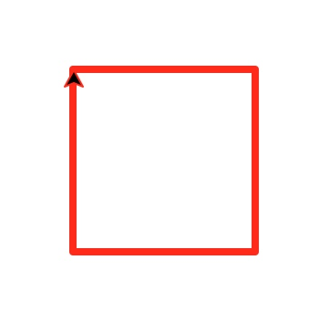

# Day01

[原文地址](https://github.com/jackfrued/Python-100-Days/blob/master/Day01-15/Day01/%E5%88%9D%E8%AF%86Python.md)
## 练习1：

在Python交互环境中查看下面的代码结果，并将内容翻译成中文。

```python
import this

Beautiful is better than ugly.
Explicit is better than implicit.
Simple is better than complex.
Complex is better than complicated.
Flat is better than nested.
Sparse is better than dense.
Readability counts.
Special cases aren't special enough to break the rules.
Although practicality beats purity.
Errors should never pass silently.
Unless explicitly silenced.
In the face of ambiguity, refuse the temptation to guess.
There should be one-- and preferably only one --obvious way to do it.
Although that way may not be obvious at first unless you're Dutch.
Now is better than never.
Although never is often better than *right* now.
If the implementation is hard to explain, it's a bad idea.
If the implementation is easy to explain, it may be a good idea.
Namespaces are one honking great idea -- let's do more of those!

```

```python
美丽好过丑恶
直白好过含蓄
简单好过复杂
复杂好过被复杂化
水平的好过叠层
稀少好过浓密

可读性有意义

特殊的案例并不能破坏规则
尽管事实会打败单纯
错误永不会悄悄通过
除非你就是想要这个悄悄的结果
在面对歧义的时候，拒绝猜测的诱惑
一定有一种合理的方式去解决它
进化这个方式在开始的时候并不明显

现在开始好过永远放弃
尽管永远放弃经常比此时此刻更好

如果去解释一段执行语句，那么它一定是一个坏主意
如果一段执行语句很容易解读，那么可它能是一个好主意

命名空间是一个响当当的好主意 -- 让我们尽可能的发扬光大吧！
```

## 练习2：
学习使用turtle在屏幕上绘制图形

```python
import turtle

turtle.pensize(4)
turtle.pencolor('red')
turtle.forward(100)
turtle.right(90)
turtle.forward(100)
turtle.right(90)
turtle.forward(100)
turtle.right(90)
turtle.forward(100)
turtle.mainloop()
```




